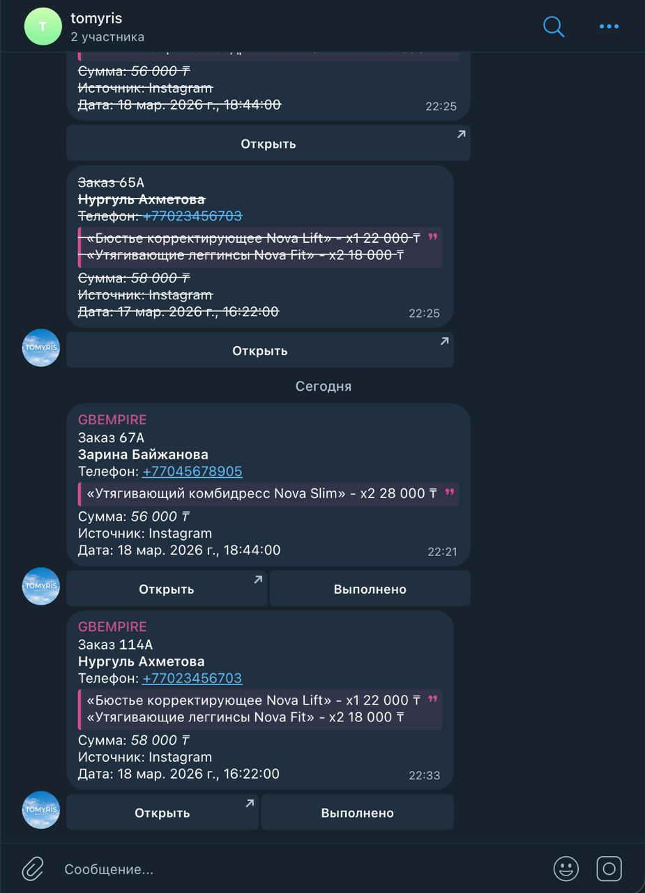
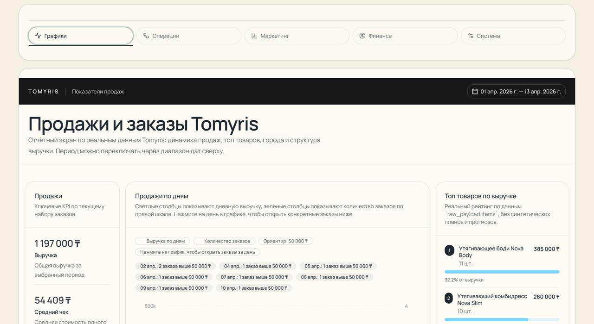
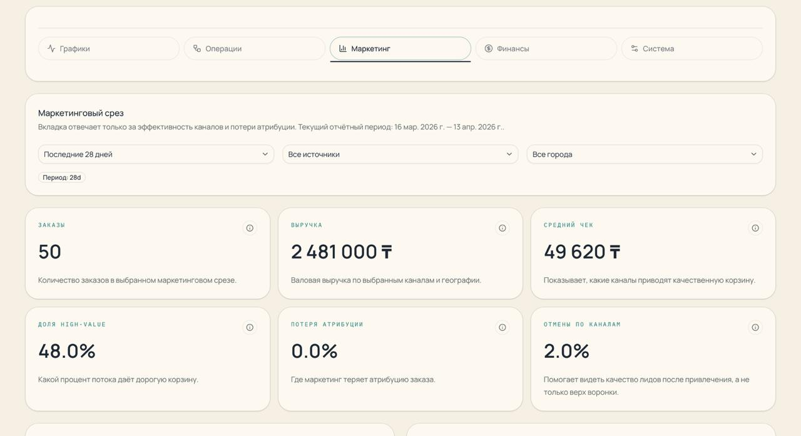
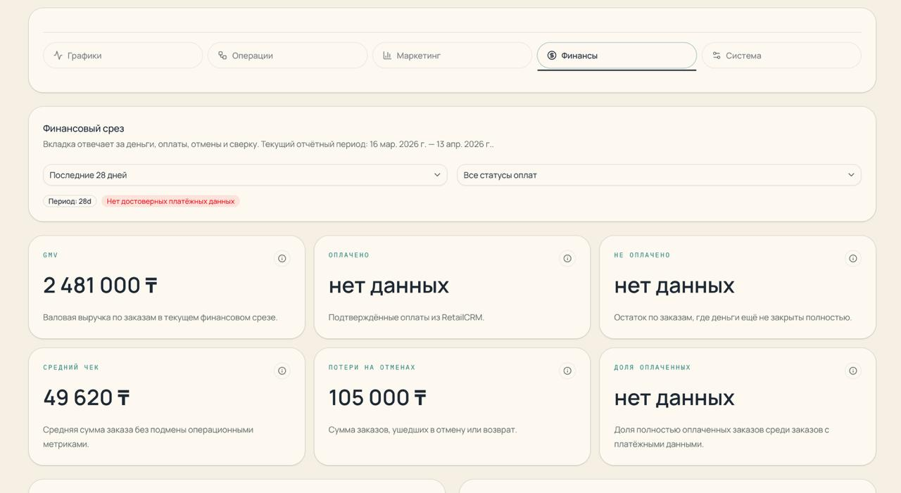

# GBC Analytics Dashboard for Tomyris

## Почему это сильное решение для GBC

Если смотреть на проект глазами hiring manager, то это не просто “сделал график и Telegram-бота”.
Это уже рабочий кусок внутренней инфраструктуры для e-commerce команды.

Что здесь важно:

- закрыт полный поток из тестового задания: `RetailCRM -> Supabase -> Dashboard -> Telegram`
- сделано больше базового минимума: manager-card, logistics-card, kanban, write-back в `RetailCRM`, event stream, sync health
- логика проверена не только кодом, но и реальными прогонами: high-value уведомления, порог суммы, автообновление дашборда
- проект показывает не только умение писать код, но и умение думать как AI-first специалист: быстро собрать workflow, проверить его, задокументировать и подготовить к расширению
- решение уже можно развивать дальше в сторону вашего реального стека: `Shopify`, `Meta Ads`, `BigQuery`, `Supabase`, AI-агенты и workflow

Моя цель в этом тестовом задании была не просто “закрыть пункты”, а показать инициативность, продуктовое мышление и умение превращать AI-инструменты в реальный рабочий результат.

## Что это за проект

Это небольшой внутренний продукт для работы с заказами.

Если сказать совсем просто:

- заказ появляется в `RetailCRM`
- проект забирает его в `Supabase`
- показывает его в дашборде
- если заказ крупный, отправляет уведомление в Telegram-группу
- менеджер может открыть заказ или завершить его прямо из Telegram-сообщения

Проект сделан как тестовое задание на роль `AI Tools Specialist`.

## Какую проблему он решает

Без такого инструмента менеджеру приходится:

- вручную заходить в `RetailCRM`
- искать нужный заказ
- смотреть сумму, состав, адрес и телефон
- отдельно контролировать крупные заказы
- отдельно понимать, что уже обработано, а что нет

Этот проект делает процесс проще:

- крупные заказы сразу видны в Telegram
- вся нужная информация есть в одном сообщении
- дашборд показывает общую картину по заказам
- менеджер и логистика получают быстрые ссылки на нужную карточку

## Как проект работает простыми словами

1. В `RetailCRM` есть заказ.
2. Скрипт или `Supabase Edge Function` забирает этот заказ.
3. Заказ сохраняется в `Supabase`.
4. Дашборд показывает его на главной странице.
5. Если сумма заказа выше порога, бот отправляет сообщение в Telegram-группу.
6. Менеджер может:
   - нажать `Открыть` и перейти в карточку заказа
   - нажать `Выполнено` и завершить заказ

## Что уже реализовано

- импорт demo-заказов из `mock_orders.json` в `RetailCRM`
- ручной и автоматический sync `RetailCRM -> Supabase`
- публичный дашборд с 5 вкладками:
  - `Графики`
  - `Операции`
  - `Маркетинг`
  - `Финансы`
  - `Система`
- автообновление дашборда раз в `45` секунд
- Telegram-уведомления по крупным заказам
- менеджерская карточка заказа с полной информацией
- логистическая карточка для сборщика / курьера
- изменение статуса заказа обратно в `RetailCRM`
- kanban по статусам
- журнал уведомлений
- event stream по заказам
- sync health и reconciliation по snapshot-слою

## Что сделано сверх базового ТЗ

Если сравнить проект с самим тестовым заданием, то здесь сделано больше, чем просто:

- “забрать заказы”
- “показать график”
- “отправить Telegram-алерт”

Дополнительно реализовано:

- manager-card и logistics-card, а не только один экран с графиком
- write-back в `RetailCRM`, а не только чтение данных
- защищённый доступ через signed links и operator token
- kanban по статусам
- журнал уведомлений
- event stream по заказам
- sync health и reconciliation
- автообновление дашборда
- тесты и реальные проверки на живых заказах

То есть проект выглядит не как “одноразовая демка”, а как маленький рабочий internal tool.

## Скриншоты интерфейса

### Главный экран дашборда


## Как выглядит интерфейс Telegram

Бот подключён к рабочей Telegram-группе через `TELEGRAM_CHAT_ID`.

Сообщение в Telegram специально сделано простым и удобным для чтения.
В нём видно:

- номер заказа
- имя клиента
- телефон
- товары
- сумму
- источник
- дату

В сообщении есть две кнопки:

- `Открыть`
  - открывает signed manager page в дашборде
  - там видна полная карточка заказа: клиент, адрес, товары, оплата, действия
- `Выполнено`
  - завершает заказ
  - переводит его в статус `complete`
- после подтверждения текст в сообщении зачеркивается, чтобы было видно, что заказ уже закрыт

То есть Telegram здесь работает не просто как “уведомлялка”, а как быстрый рабочий интерфейс для менеджера.



## Режимы доступа

В проекте есть несколько режимов:

### 1. Публичный дашборд

- маршрут: `/`
- режим: `read-only`
- показывает всю сводку по заказам
- не даёт публично менять заказ в `RetailCRM`

### 2. Manager mode

- маршрут: `/orders/[retailcrmId]?exp=...&sig=...`
- открывается только по signed manager-link
- показывает полную карточку заказа
- даёт право выполнять рабочие действия с заказом

### 3. Logistics mode

- маршрут: `/orders/[retailcrmId]/logistics?token=...`
- открывается только по signed logistics-link
- показывает упрощённую карточку для доставки

### 4. Private operator access

- доступ через `DASHBOARD_OPERATOR_TOKEN`
- нужен для защищённых write-операций и server-side действий

## Как защищён доступ на редактирование

Изменять заказы нельзя просто по открытому URL.

Для записи нужны:

- либо signed manager-link
- либо `DASHBOARD_OPERATOR_TOKEN`

Дополнительно:

- Telegram webhook защищён через `TELEGRAM_WEBHOOK_SECRET`
- sync endpoint защищён через `SYNC_ENDPOINT_SECRET`

Идея простая:

- смотреть dashboard можно безопасно
- менять заказы могут только авторизованные рабочие сценарии

## Что показывает дашборд

### Графики

Показывают:

- количество заказов
- выручку
- top products
- top cities
- сегменты заказов



### Операции

Показывают:

- KPI для оператора
- очереди заказов
- high-value поток
- проблемные заказы
- kanban по статусам


### Маркетинг

Показывает:

- источники заказов
- средний чек по источникам
- долю дорогих заказов
- потерю атрибуции



### Финансы

Показывают:

- GMV
- оплачено / не оплачено
- частичные оплаты
- возвраты
- потери на отменах



### Система

Показывает:

- правила уведомлений
- sync health
- event stream
- notification log

### Профиль заказа

Ниже показана manager-card заказа, где менеджер видит полную информацию и может выполнять действия.


## Какой стек использован

- `Next.js 16`
- `React 19`
- `TypeScript`
- `App Router`
- `Tailwind CSS v4`
- `shadcn/ui`
- `Supabase`
- `RetailCRM API`
- `Telegram Bot API`
- `Recharts`
- `Playwright`
- `node:test`

## Что есть на backend

### Скрипты

- `scripts/import-mock-orders.ts`
  - импортирует demo-заказы в `RetailCRM`
- `scripts/sync-retailcrm.ts`
  - синкает заказы в `Supabase`
  - пишет события
  - отправляет Telegram-уведомления
- `scripts/demo-reset.ts`
  - очищает операционные таблицы перед demo

### API и server-side логика

- `PATCH /api/orders/[retailcrmId]`
  - редактирует заказ
- `POST /api/orders/[retailcrmId]`
  - quick actions: передать в доставку / завершить
- `POST /api/orders/[retailcrmId]/status`
  - меняет статус заказа
- `POST /api/telegram/webhook`
  - принимает callback от Telegram-кнопок

## Какие данные хранятся в Supabase

### `orders`

Главный snapshot заказа:

- id заказа
- клиент
- контакты
- город
- сумма
- статус
- `utm_source`
- `raw_payload` из `RetailCRM`

### `notification_logs`

Журнал отправки уведомлений:

- что отправили
- кому отправили
- успешно или нет
- была ли повторная попытка

### `telegram_message_states`

Состояние Telegram-сообщений:

- sent
- confirming
- completed

### `order_events`

История событий по заказу:

- заказ появился
- статус изменился
- менеджер открыл карточку
- логистика открыла карточку
- отправилось уведомление
- заказ завершили из Telegram

### `sync_runs`

Журнал синков:

- когда sync стартовал
- когда закончился
- сколько заказов обработал
- сколько уведомлений отправил
- была ли ошибка

## Что уже проверено

Проверки были не только “по коду”, но и по реальному сценарию.

### Технические проверки

- `npm run typecheck` — успешно
- `npm test` — успешно
- `npm run build` — успешно

### Проверки логики

Проверялся реальный сценарий с заказами:

- заказ на `40 000 ₸`
  - попал в `Supabase`
  - уведомление в Telegram **не ушло**
- заказ на `58 000 ₸`
  - попал в `Supabase`
  - уведомление в Telegram **ушло**
  - в БД появился `message_id`

### Проверка автообновления

Проверялось в браузере:

- открыл дашборд
- создал новый заказ
- синкнул его
- страницу руками не обновлял
- счётчик заказов обновился сам

То есть автообновление работает.

## Какие промпты использовались для реализации

Ниже примеры нормальных рабочих промптов, которыми можно было бы вести такую реализацию через AI-инструмент.

### 1. Анализ задачи

`Проанализируй тестовое задание. Предложи минимальную архитектуру для order dashboard поверх RetailCRM, Supabase и Telegram. Раздели решение на этапы: импорт, sync, dashboard, уведомления, безопасный доступ.`

### 2. Старт проекта

`Создай Next.js App Router проект на TypeScript для внутреннего dashboard. Добавь Tailwind, shadcn/ui и базовую структуру вкладок: графики, операции, маркетинг, финансы, система.`

### 3. Импорт в RetailCRM

`Напиши idempotent скрипт импорта mock_orders.json в RetailCRM. Используй детерминированный externalId и безопасную последовательную отправку заявок.`

### 4. Синк заказов

`Сделай sync RetailCRM -> Supabase: получай заказы, нормализуй поля, делай upsert в orders, добавь event log и базовый reconciliation слой.`

### 5. Telegram workflow

`Добавь Telegram уведомления для заказов выше 50 000 ₸. Сообщение должно быть читабельным и содержать кнопки Открыть и Выполнено. Выполнено должно переводить заказ в complete.`

### 6. Карточки заказа

`Сделай manager-card и logistics-card заказа. Manager-card должна показывать полный контекст и давать действия. Logistics-card должна быть упрощённой и безопасной.`

### 7. Безопасность

`Закрой публичный write-доступ. Изменение заказа должно быть доступно только по signed manager-link или через приватный operator token.`

### 8. Проверка качества

`Добавь тесты на order normalization, write access, kanban transitions, signed links, Telegram workflow и route handlers.`

### 9. Финальная упаковка

`Подготовь README для hiring manager: просто объясни, что это за проект, какую проблему решает, как работает, что проверено и что можно улучшить дальше.`

## Оценка проекта

- для этого тестового задания: `970 / 1000`
- как internal tool поверх `RetailCRM`: `930 / 1000`
- как база для более широкой интеграции с другими сервисами: `760 / 1000`

Почему оценка высокая:

- проект закрывает основной сценарий задания
- есть не только интерфейс, но и реальный рабочий поток
- Telegram, дашборд и `RetailCRM` действительно связаны
- логика проверялась и тестами, и живыми кейсами

Что ограничивает оценку:

- это всё ещё компактное тестовое решение, а не большая платформа
- часть сценариев специально упрощена под задачу
- более сложные роли, ownership и расширенная аналитика пока не добавлены

## Что важно для проверки

Если читать README быстро, главное увидеть 5 вещей:

- проект решает понятную бизнес-проблему
- данные приходят из `RetailCRM`
- крупные заказы автоматически уходят в Telegram
- менеджер может открыть заказ и завершить его
- дашборд показывает общую картину без ручного поиска в CRM

## Что можно сделать в будущем

- добавить более глубокую модель ответственных менеджеров
- добавить персональные очереди и ownership по заказам
- сделать более богатую аналитику по процессу обработки
- расширить event stream
- добавить более детальный audit trail по изменениям заказа
- довести private operator mode до полноценной UI-конфигурации
- подключить `Shopify` как источник storefront-данных и событий по заказу
- подключить `Meta Ads`, чтобы видеть не только заказы, но и spend / attribution / качество канала
- вывести данные в `BigQuery`, чтобы построить единый аналитический слой компании
- превратить проект из order-ops dashboard в более полноценный продукт для связки `Shopify + RetailCRM + Supabase + Meta Ads + BigQuery`

## Как запустить локально

```bash
cp .env.example .env.local
npm install
npm run dev
```

Основные переменные:

- `RETAILCRM_BASE_URL`
- `RETAILCRM_API_KEY`
- `RETAILCRM_SITE_CODE`
- `SUPABASE_URL`
- `SUPABASE_SECRET_KEY`
- `APP_BASE_URL`
- `LINK_SIGNING_SECRET`
- `DASHBOARD_OPERATOR_TOKEN`
- `TELEGRAM_BOT_TOKEN`
- `TELEGRAM_CHAT_ID`
- `TELEGRAM_WEBHOOK_SECRET`
- `SYNC_ENDPOINT_SECRET`

## Команды

```bash
npm run dev
npm run build
npm run typecheck
npm test
npm run import:retailcrm
npm run sync:retailcrm
npm run demo:reset
```

## Короткий вывод

Это не просто “красивый экран”.
Это рабочий маленький инструмент для команды, которая живёт в `RetailCRM` и Telegram.

Он:

- показывает заказы
- выделяет важные заказы
- ускоряет работу менеджера
- уменьшает ручные действия
- даёт понятный контроль над операционным потоком
